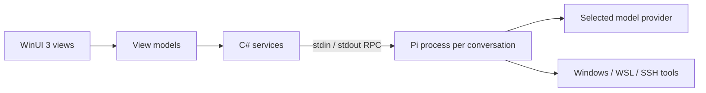

# Pi desktop

**A native Windows workspace for the [Pi coding agent](https://pi.dev/).**

Keep coding conversations, terminals, files and changes together in a WinUI 3 desktop app. Work in local Windows folders, WSL distributions or Linux SSH workspaces, while keeping each conversation’s runtime independent.

Built with **C# · .NET 10 · WinUI 3 · Pi RPC**. This is an independent frontend, not an official Pi release.

## What it does

- **Concurrent coding conversations.** Switch projects without stopping work in other conversations. Stream responses, queue follow-ups, attach screenshots and choose providers/models.
- **A readable transcript.** Virtualized history, syntax-highlighted code, sortable tables with CSV/JSON export, and code-block actions to run a snippet or save it to the project.
- **Tools beside the conversation.** Reorderable side-panel tabs for terminals, files, source control and other tools. Terminal sessions survive conversation switching until closed or the app exits.
- **Workspace checkpoints.** Opt in to recorded file changes, selective revert, conflict detection and Undo. Created, modified and deleted files appear in change summaries.
- **Optional integrations.** Manage extensions and MCP connections, discover GitHub pull requests, and start/stop Docker containers linked to projects.
- **Desktop conveniences.** Double-Shift command palette with learned ordering, searchable settings, theme/text-size preferences, and local token-usage summaries.

The app stores its catalog and presentation data locally. Prompts and tool content still go to the model providers and integrations you choose; “local” does not mean offline inference.

## Engineering focus

The project explores how to build a native product around an existing agent runtime without duplicating its responsibilities.



**Pi owns the agent:** model interaction, tool execution, session transcripts, context management and compaction. **This project owns the desktop experience:** project/target associations, process lifecycle, RPC transport, rendering, panels, preferences and optional integrations. There is no separate Node bridge or Pi fork; bundled extensions use Pi’s public interfaces where needed.

Notable implementation areas:

- **Process isolation and lifecycle:** independent conversation processes, correlated asynchronous RPC, cancellation and cleanup, without automatically replaying failed operations.
- **Native rendering and state:** virtualized transcript containers, coalesced streaming updates, and conversation state that survives view recycling.
- **Target-aware operations:** Windows, WSL and SSH paths/transports with explicit capability boundaries and no silent fallback to local execution.
- **Safe restore and persistence:** checkpoint journals, conflict checks, atomic preference/catalog writes and deferred cleanup for unavailable targets.
- **Testable boundaries:** UI-independent models, services and view models tested without launching WinUI or contacting model providers.

See [architecture](ARCHITECTURE.md) for implementation details and tradeoffs.

## Build and try it

### Prerequisites

- Windows 10 version 2004/build 19041 or later, or Windows 11. The current installer targets **x64**.
- **.NET 10 SDK** and Windows/WinUI build tooling. A Visual Studio installation with Windows application development tools is the straightforward setup; package versions are pinned in `PiAgentGui.csproj`.
- **WebView2 Runtime** for embedded terminal rendering. The local installer checks for it.
- **Pi installed separately**, plus its runtime prerequisites and a configured model provider. See [Pi setup](docs/PI-SETUP.md). Pi is not needed for the default tests.

From the repository root:

```powershell
dotnet build PiAgentGui.csproj -p:Platform=x64
dotnet test Tests/PiAgentGui.Tests.csproj
```

To run a development build, open the solution in your Windows IDE and choose the **PiAgentGui (Unpackaged)** launch profile with an x64 configuration.

For a local Release installation, install **Inno Setup 6.7.3**, close Pi desktop, then run:

```powershell
./Installer/Install-Local.ps1
```

This builds the current checkout, installs for the current Windows user and verifies the installed version. It preserves app data and does not launch the app afterward. See [installer instructions](Installer/README.md) for details. Local installers are unsigned; there is no automatic updater.

## Testing and current limits

The default test command skips explicitly opt-in Windows credential/helper and live MCP checks. It does not require a provider account. See [test instructions](Tests/README.md) for selecting those checks and their prerequisites.

The app is a personal project under active development. Local Windows is the primary desktop experience; some native panels and third-party integrations remain local-only even when agent tools run in WSL/SSH. Live SSH and some end-to-end workflows have not been fully verified. See [execution targets](docs/EXECUTION-TARGETS.md) and [checkpoints](docs/CHECKPOINTS.md) for precise limits.

Agent tools and Run actions execute with the selected environment’s permissions. Approval controls are not a sandbox. Review changes and use backups for important work.

## Project guides

| Guide | Contents |
| --- | --- |
| [Architecture](ARCHITECTURE.md) | Runtime ownership, persistence and current behavior |
| [Pi setup](docs/PI-SETUP.md) | Runtime discovery, providers and integrations |
| [Execution targets](docs/EXECUTION-TARGETS.md) | Windows, WSL and SSH setup and limits |
| [Workspace checkpoints](docs/CHECKPOINTS.md) | Capture, revert, Undo and cleanup |
| [GitHub setup](docs/GITHUB-SETUP.md) | Optional GitHub App/device-flow configuration |
| [Tests](Tests/README.md) | Default tests and opt-in integration checks |
| [Installer](Installer/README.md) | Local build, installation and upgrades |
| [Backlog](docs/BACKLOG.md) | Remaining work and optional ideas |

For changes, follow existing MVVM/service boundaries, add relevant tests, and update the guide that describes the affected behavior. [AGENTS.md](AGENTS.md) contains repository instructions for coding agents; [the design brief](.ui-craft/brief.md) records UI constraints.

## License and attribution

Original code and documentation are available under the [MIT license](LICENSE), copyright Eliaszac. Dependencies and bundled artwork retain their own terms; see [third-party notices](Legal/THIRD-PARTY-NOTICES.md) and [branding](docs/BRANDING.md). The MIT license does not relicense third-party assets.

[Terms](Legal/TERMS.md) and [privacy/data information](Legal/PRIVACY.md) are also available offline in Settings → Legal & privacy.
